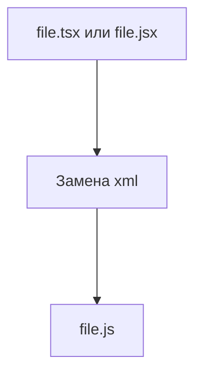

# Начало
Все мы знаем, как порой долго и неудобно делать пользовательские интерфейсы, используя бесконечные объекты и переключая их данные, как выключатель в комнате.
Данная библиотека предлагает скинуть всю монотонную работу на xml разметку, встраивая и манипулируя компонентами и фрагментами, как вам угодно, позволяя сокращать код на многие десятки или даже сотни строк.

## Причём тут сайты
Поскольку мы будем использовать jsx и tsx формат, стоит поговорить о том, что это такое и откуда оно появилось. TSX в полной форме означает TypeScript XML, что в виде кода напоминает html внутри кода js:
```tsx
const drawing = (
    <drawing>
        <text>a</text>
        <text>b</text>
        <text>o</text>
        <text>b</text>
        <text>a</text>
    </drawing>
);
```

### Facebook + React
Много лет назад такая компания, как Facebook, решила выпустить инструмент, который позволил писать сайты проще, исключая html почти полностью.

Они разработали надстройку над JavaScript: **React**, которая позволяет встраивать xml-подобный код прямо внутри JavaScript. После транспиляции он заменяется на вызов некоторых функций, которые при помощи древа DOM создавали новые элементы на странице сайта.

Этот формат официально поддерживается транспилятором TypeScript и поддерживает подставление собственных функций-исполнителей. На этом и основана библиотека. 



## Компоненты
Компоненты - это небольшие функции, которые возвращают xml разметку. В нашем случае чаще всего это будут элементы. На их основе будут строиться многие примеры кода в данном руководстве.

## Фрагменты
Фрагмент - это компонент, сформированный из нескольких тегов или компонентов. Это позволяет создавать более сложные структуры, а так же удобно компоновать их с обычными элементами окна, не нарушая основной вид.

## Окна
Окна так же можно строить при помощи xml, и в таком случае они будут возвращать экземпляры класса в зависимости от выбранного тега для окна. Их иерархия поддерживает как элементы, так и прочие параметры стилизации.

## Подключение
1. Зайдите в [папку с файлом библиотеки](https://github.com/ArtemKot4/libraries/tree/main/dev/Component);
2. Найдите в этой папке файл `settings.json`, содержащий настройки для транспилятора TypeScript;
3. Вставьте значения внутрь вашего tsconfig, а в случае тулчейна от автора Nernar добавьте поле <u>tsconfig</u> с значениями из файла `settings.json` в файл `make.json`;
4. Добавьте файл `Component.tsx` в ваш проект и объявите его в файле `.includes` или `tsconfig.json`;
5. Переименуйте расширения файлов, где будете использовать компоненты, в **tsx**;
6. Запустите задачу пересборки деклараций или поменяйте нужное вручную;
