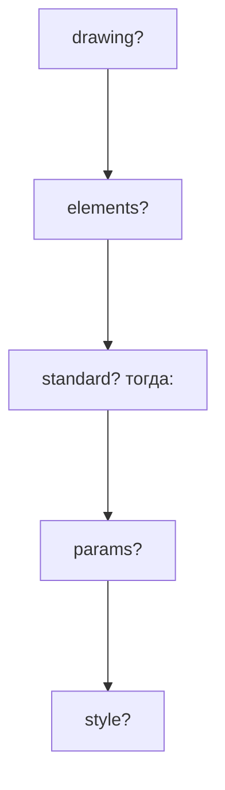

# Окна через tsx
Ранее мы рассматривали лишь компоненты и фрагменты, но библиотека располагает более широкими возможностями, позволяя делать окна полностью при помощи xml разметки.

## Параметры окна
Для начала разберёмся с параметрами:
```ts
{
    //ширина окна
    width?: number; 
    //высота окна
    height?: number
    //размер окна 
    scale?: number; 
    //фоновый цвет окна
    background?: number; 
    //позиция окна по x
    x?: number; 
    //позиция окна по y
    y?: number;
    //скроллинг по x
    scrollX?: number;
    //скроллинг по y
    scroolY?: number;
    //может ли скроллинг меняться по x пока окно открыто
    forceScrollX?: boolean;
    //может ли скроллинг меняться по y пока окно открыто
    forceScrollY?: boolean;
    //будут ли размеры элементов вычисляться по размеру окна
    globalScale?: boolean;
    //будет ли окно являться игровым оверлеем
    overlay?: boolean;
    //будет ли окно динамическим. По умолчанию true
    dynamic?: boolean;
    //будет ли окно кликабельным (функции клика будут работать)
    touchable?: boolean;
    //будет ли поддержка слотов инвентаря
    inventoryNeeded?: boolean;
    //будет ли фон затемнён и некликабелен
    blockingBackground?: boolean;
    //будет ли закрываться при нажатии кнопки назад на устройстве
    closeOnBackPressed?: boolean;
    //какая прозрачность будет при открытии. Используйте если окно всегда не полностью непрозрачное
    alpha?: number;
    //функция вызывается при открытии окна
    onOpen?(window: UI.IWindow);
    //функция вызывается при закрытии окна
    onClose?(window: UI.IWindow);
}
```
Все эти параметры являются атрибутами тегов window и standardWindow или standartWindow.

## Иерархия
На схеме отображены вложения, поддерживаемые окнами:

Вы можете спросить, где же location? Его нет, поскольку его параметры можно указать в атрибутах окна. Это сделано для более лёгкого и удобного описания окон.

### Drawing
Drawing описывается так же, как и простые элементы, за исключением атрибута name:
```tsx
<drawing>
    <text>a</text>
    <text>b</text>
    <text>o</text>
    <text>b</text>
    <text>a</text>
</drawing>
```

### Elements
Elements описывается так же, как и фрагменты:
```tsx
<elements> 
    <text name="aboba" marginBottom="25">Hi world!</text>
    <text name="aboba2" marginBottom="10" text="Hi!"/>
</elements>
```

### Standard
Standard описывается как тег, принимающий следующие атрибуты:
```ts
{
    minHeight?: number;
    background?: com.zhekasmirnov.innercore.api.mod.ui.window.StandardWindowDescriptionTypes.StandardWindowBackground;
    header?: com.zhekasmirnov.innercore.api.mod.ui.window.StandardWindowDescriptionTypes.StandardWindowHeader;
    inventory?: com.zhekasmirnov.innercore.api.mod.ui.window.StandardWindowDescriptionTypes.StandardWindowInventory;
}
```

### Params
Params представлен как тег, принимающий любые атрибуты вида:
```ts
{[key: string]: string}
```

### Style
Style представлен как тег, принимающий любые атрибуты вида:
```ts
{[key: string]: string}
```
## Пишем своё окно
Напишем небольшое окно UI.Window:
```tsx
const window = (
    <window x="500" forceScrollY={true} onOpen={(window)=>console.log("aboba")}>
        <drawing>
            <text>Спасибо</text>
            <text>за</text>
            <text>внимание!</text>
        </drawing>
        <elements> 
            <text name="aboba" marginBottom="25">Дальше - больше!</text>
        </elements>
    </window>
);
```