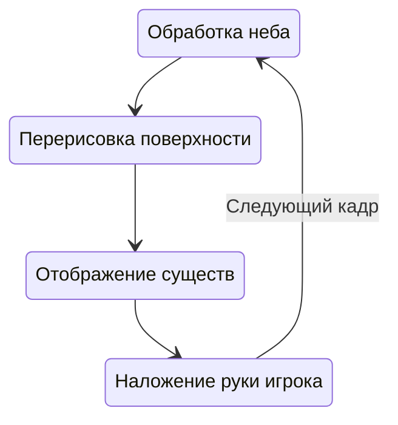

# Структура потоков

Мультипоточность для любой современной системы, среды, приложения, да и просто для скрипта, имеет первостепенное значение. Но не в случае Майнкрафта. Эта игра использует один поток фактически на все: отображение интерфейсов, генерацию мира, отображение существ и прочего. Пока это идентично работает на всех изданиях игры, создавая проблемы с производительностью и повышая системные требования. Но все ли так плохо и когда можно задействовать несколько потоков, а также, для чего вообще это нужно. Давайте разбираться.

## Что такое поток

Многие сразу могли заметить для себя новый термин, так что если вы еще не пошли искать его в сети, давайте рассмотрим это в наиболее простой тематике. Поток занимается последовательной обработкой возложенных на него процессов. Не волнуйтесь, давайте просто посмотрим на реальный пример, так все станет понятнее.

Итак, представим себе цикл отрисовки мира игры:

Начиная с обработки неба, мы заканчиваем наложением руки игрока, начиная все снова и снова, и так до тех пор пока мир используется игроком. Это четыре совершенно разных и не связанных друг с другом процесса. Однако, кое-что общее у них все же есть. Их обработает один поток. Это означает, что процессы будут выполнены друг за другом, последовательно, и ни один из них не может завершиться раньше другого.

Приходя к понятию многопоточности, можно подумать, что процессы просто выполнятся в разных потоках. И это может быть так, но скорее всего несколько потоков понадобится под разные виды задач, а не конкретные процессы. Дело в том, что любой процесс состоит из действий — тех строчек кода, что находятся в вашем скрипте. И обычно программисты отделяют ресурсоемкие задачи (не требующие срочной обработки) в отдельные процессы, оставляя основной поток разгруженным для совершения менее сложной работы быстрее.

Игровой мир обрабатывает все вместе, используя лишь один поток. Это несет для нас некоторый ряд ограничений, ибо выполнение действий параллельно друг другу в большинстве случаев попросту не предусмотрено, а отдельные потоки обрабатываются именно так. Майнкрафт не ассинхронен (не может параллельно обрабатывать процессы), так рассмотрим же каким именно образом это повлияет на нас.

## Создаем процессы

Мультипоточность создается за счет конструкций Java, платформа оптимизирована для запуска потоков.

:::danger Прямое использование потоков

Используя Java или Android SDK, может возникнуть желание использования мультипоточности. Со стороны языка в этом нет проблем, платформа оптимизирована под это, созданные потоки [java.lang.Thread](TODO) обрабатываются точно так же как и обновляемые объекты.

Но не делайте этого! Майнкрафт НЕ ассинхронен, создание таких потоков для взаимодействия с миром не допускается. Мультипоточность совместно с тиком (по совместительству и с обновляемыми объектами) приводят к утечкам и крашам.

Поток нужен не для взаимодействия с игрой? Если обновляемые объекты и тик не могут решить вашу проблему, воспользуйтесь [Threading.init](/api/Threading/init).

:::
