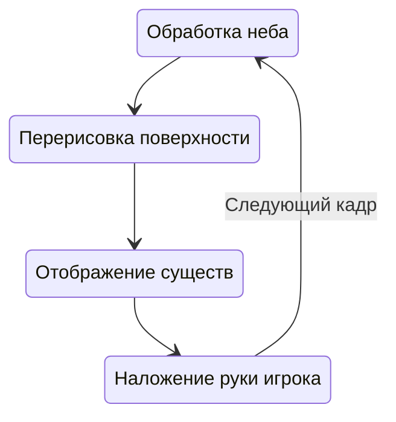

# Структура потоков

Мультипоточность для любой современной системы, среды, приложения, да и просто для скрипта, имеет первостепенное значение. Но не в случае Майнкрафта. Эта игра использует один поток фактически на все: отображение интерфейсов, генерацию мира, отображение существ и прочего. Пока это идентично работает на всех изданиях игры, создавая проблемы с производительностью и повышая системные требования. Но все ли так плохо и когда можно задействовать несколько потоков, а также, для чего вообще это нужно. Давайте разбираться.

## Что такое поток

Многие сразу могли заметить для себя новый термин, так что если вы еще не пошли искать его в сети, давайте рассмотрим это в наиболее простой тематике. Поток занимается последовательной обработкой возложенных на него процессов. Не волнуйтесь, давайте просто посмотрим на реальный пример, так все станет понятнее.

Итак, представим себе цикл отрисовки мира игры:



Начиная с обработки неба, мы заканчиваем наложением руки игрока, начиная все снова и снова, и так до тех пор пока мир используется игроком. Это четыре совершенно разных и не связанных друг с другом процесса. Однако, кое-что общее у них все же есть. Их обработает один поток. Это означает, что процессы будут выполнены друг за другом, последовательно, и ни один из них не может завершиться раньше другого.

Приходя к понятию многопоточности, можно подумать, что процессы просто выполнятся в разных потоках. И это может быть так, но скорее всего несколько потоков понадобится под разные виды задач, а не конкретные процессы. Дело в том, что любой процесс состоит из действий — тех строчек кода, что находятся в вашем скрипте. И обычно программисты отделяют ресурсоемкие задачи (не требующие срочной обработки) в отдельные процессы, оставляя основной поток разгруженным для совершения менее сложной работы быстрее.

Игровой мир обрабатывает все вместе, используя лишь один поток. Это несет для нас некоторый ряд ограничений, ибо выполнение действий параллельно друг другу в большинстве случаев попросту не предусмотрено, а отдельные потоки обрабатываются именно так. Майнкрафт не ассинхронен (не может параллельно обрабатывать процессы), так рассмотрим же каким именно образом это повлияет на нас.

## Создаем процессы

Мультипоточность создается за счет конструкций Java, платформа оптимизирована для запуска потоков. Для чего их использовать? Вариантов масса — от обработки информации до анимирования интерфейсов. Тут решать только вам и давать каких бы то ни было рекомендация мы не можем, советую изучить [сторонюю статью](TODO).

Начнем с создания простого потока, имитирующего работу. В общем случае, потоки создаются с помощью метода:

```js
Threading.initThread(name, action, priority?, isErrorFatal?, formatFunc?)
```

Где `name` определяет строковый идентификатор, а `action` описывает процесс, совершаемый потоком. Давайте в качестве примера запустим ресурсоемкую задачу:

```js
Threading.initThread("mod_testProcess", function() {
    alert("Запускаем процесс");
    for (let i = 0; i <= 5; i++) {
        java.lang.Thread.sleep(4000);
        alert((i / 5 * 100) + "%");
    }
    alert("Готово!");
})
```

Правда вместо задачи мы просто "усыпили" поток на 4 секунды. Идентификатор потока может быть любым, но лучше придерживаться чего-то вроде *краткоеимямода_описаниеПроцесса* (к примеру, `tcon_crafting`). Поэкспериментируйте с различными задачами, мы неоднократно затронем потоки в будущем.

Вследствии вызова этого метода, созданный объект потока может быть получен по имени, используя `getThread`. Объект потока является его обработчиком, выделим ключевые методы здесь:

```js
const thread = Threading.getThread("mod_testProcess");
if (thread) { // процесс уже мог быть завершен
    const another = Threading.initThread("mod_asyncProcess", function() {
        while (thread.isAlive()) { // процесс уже мог быть завершен
            // прерывание с минимальным периодом времени
            java.lang.Thread.yield();
            // можно воспользоваться join как альтернативой
        }
        alert("Предыдущий поток завершен!");
    });
    if (!another.isInterrupted()) {
        // прерывание потока вызовет ошибку внутри него
        // если использовать sleep или yield; если же
        // поток уже усыплен, ошибка вызовется сразу
        another.interrupt();
    }
}
```

Большинство из этих методов могут быть вызваны в текущем потоке, используя `java.lang.Thread.*` (где * — название метода). Либо наоборот, методы `java.lang.Thread` могут быть вызваны на объекте обработчика.

Так в каких случаях ни в коем случае нельзя использовать потоки?

- Размещение блоков, призыв существ, изменение их атрибутов и прочее
- Получение информации о игровом мире, атрибутов существ, блоков и прочего
- Любые действия, связанные с нативной частью, если это затрагивает игру

Вы никогда не можете точно знать какой проект может вызвать проблемы потоков, результат их постоянного использования неизвестен и уникален для каждого случая. Лучше воспользуйтесь [обновляемыми объектами](updatables.md), они предсказуемы и не вызывают рассинхронизаций. А потоки не должны использоваться для взаимодействия с игрой от слова совсем.

### Реальные примеры

В этих проектах можно посмотреть нежелательные реализации, либо наоборот, примеры пригодные для использования в ваших модах, а также библиотеки для расширения функциональности потоков.

<!-- Расширяйте этот список самостоятельно по мере необходимости. -->

1. Нестабильные (потоки используются не по назначению)

   1. Библиотека AdvancedEvents — получение данных о мире и существах, сами события неасинхронны с игрой
   2. Библиотеки StructuresAPI и Dungeon Utility — размещение блоков, изменение контейнеров нативных тайлов
   3. Библиотека BookModel — изменение мешей рендера анимации
   4. Библиотека Transition — изменение атрибутов и положения существ
   5. Библиотека Bow — изменение угла зрения игрока
   6. Aim Assist — получение данных о мире, его существах и изменение угла поворота существ
   7. Utils+ и EnderIO — поиск ближайших контейнеров и блоков для получения энергии
   8. Tinkers' Construct — разрушение и получение блоков, изменение рендера анимаций
   9. Super stone sword — удаление существ и получение их атрибутов
   10. Sparks Hammers — разрушение блоков
   11. Ex Nihilo Origin — размещение блоков, изменение позиции существ
   12. random_drop — получение существ и их атрибутов, удаление и изменение
   13. Minimap — получение данных о мире, его блоках и атрибутов существ
   14. Minechemistry — изменение частей рендера анимаций
   15. Landslide Mod — получение, разрушение и установка блоков
   16. Direction HUD — получение угла поворота существ

2. Отличные примеры использования

   1. Библиотека Action — использование тикоподобных потоков на основе условий c жизненным циклом и остановкой
   2. Библиотека Sequence — использование ресурсоемких потоков совместно с обновлениями интерфейсов
   3. Библиотека ScrutinyAPI — использование интерполяции для создания анимации интерфейса достижений
   4. Библиотека workbench — обновление списка рецептов верстака с последующим открытием
   5. Библиотека Connectivity — асинхронная выгрузка и загрузка файлов, а также чтение информации из сети
   6. RefinedStoragePE — обработка контейнера верстака с синхронизацией данных между сервером и клиентом
   7. Backups — асинхронное формирование интерфейса списка миров с последующим обновлением
   8. Recipe Viewer — создание анимаций текста в интерфейсе и асинхронная подгрузка данных
   9. We will bedrock U — поиск ближайшей магической зоны со сложными вычислениями
   10. Divine Favor — проверка обновлений из удаленного репозитория
   11. ModBrowser — создание анимаций текста в интерфейсе

## Интерфейс системы

Помимо внутреигрового интерфейса, контейнеров и окон движка, существует возможность использования Android API для разработки интерфейсов, созданных на его основе.
