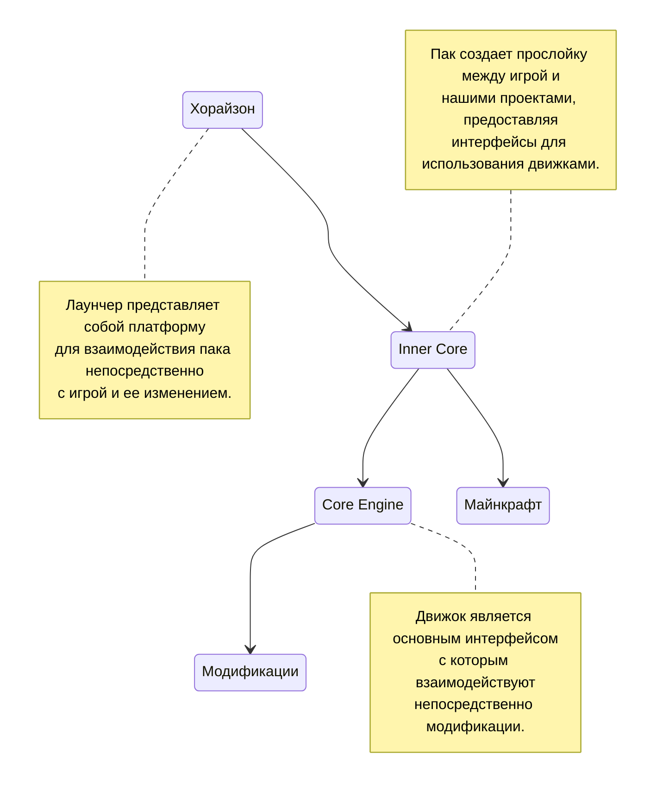

# Методология

Любой проект так или иначе имеет некоторую сводку базовых терминов, в которых любой из нас должен свободно плавать, не забывая базовые концепции. Важно помнить, что Майнкрафт — игра, которая поощряет творчество и свободу действий, поэтому нет строгих правил или ограничений в методологии. Однако, можно описать общие шаги и подходы, которые могут быть использованы при игре или при создании модов для нее.

## Игровое пространство

Начнем с того, из чего в целом состоит новосозданный пользователем мир в Майнкрафте:

1. Блоки — являются основными строительными материалами в мире. Они представляют собой различные кубоподобные ячейки, такие как земля, камень, дерево, руды, тайлы и другие. Блоки могут быть разрушены, перемещены и использованы для создания различных строений, механизмов или даже структур.

2. Предметы — есть множество различных предметов, которые можно создать, найти или получить в игре. Сюда входят инструменты, оружие, броня, пища, ресурсы и многое другое. Предметы могут использоваться для выполнения различных задач, таких как добыча других предметов, сражения с мобами или даже строительства.

3. Мобы — это существа, которые населяют игровой мир. Они могут быть как дружелюбными, например, деревенскими жителями, так и враждебными, например, зомби или криперами. Мобы могут атаковать игрока или других мобов, а также выполнять различные действия, вроде опыления цветов пчелами.

4. Генерация мира — мир генерируется процедурно, что означает, что каждый новый мир создается случайным образом. Сюда входит генерация ландшафта, пещер, рек, деревьев, структур вроде деревень и прочего. Ландшафт разделен на различные уникальные участки местности, такие как леса, пустыни, горы, равнины и подобные, называемые биомами. Каждый биом имеет свои уникальные особенности, растительность, климат и ресурсы.

5. Режимы игры — выживание, творчество и приключение. Каждый режим предполагает разные правила и цели, позволяя игрокам выбирать опыт, который больше всего соответствует их предпочтениям.

Это лишь базовые аспекты, каждый из которых еще будет рассмотрен на просторах этой документации. Игра предлагает бесконечные возможности для исследования, строительства и приключений, которые каждый сможет расширить после погружения в следующие статьи.

## Из чего состоит проект

Проект это некая абстракция, идея которую необходимо реализовать:

1. Концепция и дизайн — начальная стадия, где разработчик определяет идею и концепцию мода. Он решает, какие новые элементы или функции будут добавлены в игру и как они будут взаимодействовать с существующими аспектами.

2. Разработка кода — этот этап включает программирование новых функций и элементов мода. Разработчик использует язык программирования для создания необходимых классов, методов и алгоритмов.

3. Создание текстур и моделей — визуальные аспекты мода, такие как текстуры блоков и предметов, анимации и модели мобов, которые обычно разрабатываются с использованием графических инструментов.

4. Тестирование и отладка — перед завершением разработки, мод должен быть тщательно протестирован на наличие ошибок и багов. Разработчик должен убедиться, что мод работает правильно и совместим с другими модами и версиями игры.

5. Компиляция и публикация — после успешного тестирования, мод должен быть упакован в соответствующий формат и распространен посредством встроенного браузера.

## Движок, пак и лаунчер

Каждый проект так или иначе задействует игровые интерфейсы (API — Application Programming Interface), которые облегчают разработку модов. Чтобы они были доступны разработчикам напрямую, существуют паки, запускаемые непосредственно лаунчером, предварительно загружая игру. Не совсем понятно, понимаю, лучше рассмотрим это на стандартной для большинства проектов схеме:

Эта тема еще неоднократно будет затронута, ну а пока ограничимся парой терминов. Ни оригинальные авторы игры, ни создатели лаунчера или документации не относятся друг к другу. Любые ошибки и предложения отправляйте лишь тем, кто представляет тот или иной ресурс, или же комьюнити.

## Что такое моды и модпаки

Мод, или же *модификация*, дословно означает изменение процесса игры (геймплея) с помощью добавления или внесения правок в существующий контент. Любой элемент [игрового пространства](#игровое-пространство) может быть использован для расширения и изменения игрового опыта, добавляя новые возможности. Модами на движках Inner Core принято называть папки, содержащие ресурсы, вроде текстур и файлов описания, скрипты, описывающие логику исполняемых алгоритмов в процессе игры, и настройки работы этих алгоритмов.

Под *сборкой* (модпаком) подразумевают некоторое количество модов, обычно объединенных дополнительными модами для добавления интеграций между ними. Каждая сборка имеет собственный список миров, а также настройки для установленных модов. Пользовательские сборки могут быть созданы непосредственно в интерфейсе лаунчера, обычно просто для разделения списка миров и наборов модов под разные цели.
