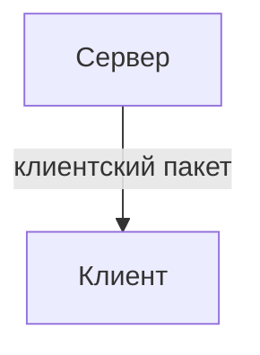

# Клиентские пакеты
<!-- Кажется, мы снова встретились! Добро пожаловать клиент, рассказ будет интересным. -->
Клиентские пакеты, это одна из вещей, без которых не обходится практически ни один магический мод.

В этой статье мы разберёмся, для чего нужны клиентские пакеты, как их использовать и рассмотрим применение на практическом примере.

<!-- Жил был сервер, и всё у него было спокойно. Он, как обычно управлял миром, сменял день да ночь, блоки ставил как хотел. Он не ждал гостей и был одинок, это было его проклятием. В один чудесный день произошло чудо, он встретил клиентов. Но грусть не покидала его, он не мог с ними общаться, хоть и очень хотел. Он изобрёл пакеты, и подумал, вдруг это поможет, вдруг они смогут поговорить! Но клиенты неправильно поняли его замысел. Они его боялись, на улице шёл дождь, капли спускались с старых деревянных крыш деревенских домов. Ближе к ночи грянул гром, клиенты забились в страхе. Они не видели сервер, они боялись его. Но нашёлся смельчак, который решил, что хочет пообщаться с сервером, вдруг все слухи неоправданы, вдруг сервер друг. Вышел он с утра на улицу, позвал сервер, а потом к нему пришёл пакет... -->

## Что такое клиентские пакеты
Клиентские пакеты представляют из себя функции, которые отправляются <u>с сервера на клиент</u> и там выполняются, принимают данные при отправке. Они являются способом общения сервера с игроками и очень полезны. 



Чтобы отправить пакет нам нужно получить объект клиента. На клиент всегда отправляются <u> только клиентские пакеты </u>.
## Методы
Давайте начнём с методов:
```ts
//получили объект клиента конкретного игрока
Network.getClientForPlayer(айди игрока);

//получили объекты клиентов всех игроков
Network.getConnectedClients(); 

//отправит на все клиенты пакет с сервера
Network.sendToAllClients(name, data: object);

//добавит клиентский пакет
Network.addClientPacket(name, func: (data: object) => void); 

//отправит сообщение всем клиентам
Network.sendServerMessage(text);

//превратит серверный айди в локальный (который на клиенте)
Network.serverToLocalId(id: string | number);

//отправит на клиент пакет с сервера
<NetworkClient>.send(name, data: object); 

//отправит клиенту текст в чат
<NetworkClient>.sendMessage(text); 
```
Мы бы могли разобрать клиентские пакеты на основе примера банальной отправки текста в чат, но давайте будем креативнее! Помните, мы писали [анимацию траты денег](../ui/animation)? Давайте применим её. Мы будем вызывать её с числом, которое будет являться новым уровнем опыта, которое получил игрок.
## Создание пакета
Наш пакет будет запускать на клиенте анимацию с текстом, приходящим из данных пакета. В нашем примере мы применим TypeScript, но лишь для демонстрации приходящих данных.
```ts
Network.addClientPacket("packet.example.start_animation", (data: { text: string }) => {
    if(!data.text) {
        return; //если мы не получили данные, анимация не появится
    }
    animator.init(data.text); //запускаем анимацию
});
```
## Применение пакета
Отправим наш пакет с сервера на клиент по имени пакета и передадим данные об уровне в качестве текста для анимации.
```js
Callback.addCallback("ExpLevelAdd", (level, playerUid) => {
    const client = Network.getClientForPlayer(playerUid); //получили объект клиента в серверном калбеке.
    if(client != null) {
        client.send("packet.example.start_animation", { text: level }); //отправили данные по имени пакета полученному клиенту
    }
});
```
:::note Почему мы просто не запустим анимацию в серверном калбеке?
Дело в том, что нам нужно запустить её на конкретном устройстве, конкретному игроку.
:::

:::warning Всегда проверяйте, что объект клиента не равен null

Это позволит избежать редких ошибок.

:::

## Синхронизация айди
Представим, мы с сервера отправляем данные о айди предмета на клиент. Снова применим TypeScript для демонстрации.
```ts
Network.addClientPacket("packet.example.sync_id", (data: { id: number, count: number, data: number, extra?: ItemExtraData }) => {
    const id = data.id //что же не так?
});
```
Код кажется правильным, но айди на сервере и на клиенте могут отличаться. Давайте получим правильный айди при помощи метода ``Network.serverToLocalId`` и отобразим частицу предмета над игроком.
```ts
Network.addClientPacket("packet.example.sync_id", (data: { id: number, count: number, data: number, extra?: ItemExtraData }) => {
    const id = Network.serverToLocalId(data.id);
    const position = Entity.getPosition(Player.getLocal());
    Particles.addBreakingItemParticle(
        id, //айди предмета
        0, //дата частицы
        position.x + 0.5, //по середине по x 
        position.y + 2, //на 2 блока выше позиции игрока по y
        position.z + 0.5 //по середине по z
    );
});
```
Если у вас не осталось вопросов, могу вас поздравить! А если нет, всегда можно перечитать статью и попрактиковаться.
Вот несколько задач для вас по возрастанию сложности:
1. Напишите клиентский пакет, который будет выводить в чат название предмета. Чтобы получить имя, можете применить метод ``IDRegistry.getNameByID(id: number)``.
2. Напишите метод, который выведет имена всех игроков в чат на клиенте.
3. Напишите собственную простенькую анимацию, которая отобразит имена и количество здоровья всех игроков на клиенте.
4. Напишите метод, который отсортирует инвентарь по айди измерения. Например если игрок находится в обычном мире, все предметы будут выброшены кроме тех, которые отображают какие-то числа измерения. Например если измерением является обычный мир, предмет будет помещён в слот с номером 1 (если это возможно, иначе к ближайшему возможному), потому-что айди измерения 1. После этого отправьте клиенту пакет и оповестите его о сортировке через [``Game.tipMessage(text)``](/api/core-engine/Game.d.ts), сообщив, какие предметы были выложены и по какому измерению.