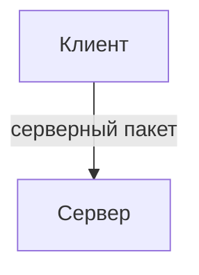

# Серверные пакеты

О, вы снова здесь. Спасибо, что читаете нас!

В статьях ранее мы разбирали клиентские пакеты, и мультиплеер казался достаточно простым. Начиная с этого момента материал станет сложнее, начинается работа с безопасностью, пакеты придётся защищать. Читайте очень внимательно.

Мы напишем небольшую механику системы изучений, и будем пробовать использовать её пакеты не по назначению. Мы будем постепенно переписывать наши пакеты, чтобы обеспечить достойную безопасность. Так же попробуем выявлять и сразу же кикать нарушителей.

## Что такое серверные пакеты

Серверные пакеты представляют из себя функции, которые отправляются <u>с клиента на сервер</u> и там выполняются, принимают данные при отправке и предоставляют объект клиента, который его отправил. Они являются способом общения клиента с сервером и очень полезны.



## Методы

```js
//отправит с клиента серверный пакет
Network.sendToServer(name, data: object);

//добавит серверный пакет
Network.addServerPacket(name, func: (client: NetworkClient, data: object));

//вернёт список uid игроков на сервере
Network.getConnectedPlayers();

//превратит локальный айди в серверный
Network.localToServerId(id: string | number);

//вернёт uid игрока, которому принадлежит объект клиента
<NetworkClient>.getPlayerUid();

//исключит игрока из мира, используйте с осторожностью
<NetworkClient>.disconnect(reason); 
```

## Пишем простую систему изучений

### Пишем базу данных и изучения

```js
const Manager = {
    learnings: ["construction", "table", "wall_break", "furnace", "tool"],
    registerLearning(name) {
        this.learnings.push(name);
    },
    players: {},
    addLearningFor(playerUid, name) {
        this.players[playerUid] = this.players[playerUid] || []; //добавим игрока в базу данных если его нет
        this.players[playerUid].push(name);
    },
    sendFor(playerUid) {
        const client = Network.getClientForPlayer(playerUid);
        if(client != null) {
            client.send("packet.example.sync_learnings", this.players[playerUid]); //пакет мы напишем чуть позже
        }
    }
}
```

### Пишем сохранение данных

Отлично, у нас есть база данных. Давайте теперь напишем [сохранение данных](../storage/saving-basics) изучений наших игроков.

```js
Saver.addSavesScope("scope.example.learnings", 
    function read(scope) {
        return scope ? scope : {} //если мы сохраняли раньше данные, читаем их, иначе поставляем пустой объект
    },
    function save() {
        return Manager.players || {}; //записываем в scope наш объект Manager.players если нет ошибок, иначе пустой объект
    }
);
```

### Пишем отправку данных о изучениях игрока клиенту

Напишем клиентский пакет, который будет отправлять данные об изучениях с сервера клиенту и записывать их для него. Не забывайте, что значения в переменных на клиенте и на сервере не связаны.

Поскольку data это объект, и массив это объект, мы будем отправлять сразу массив.

```ts
Network.addClientPacket("packet.example.sync_learnings", (data) => {
    Manager.players = Manager.players || {}; //создаём объект для данных если он был удалён
    Manager.players[Player.getLocal()] = data; //получили айди игрока на клиенте и записали пришедшие данные на клиент.
});
```

:::info Почему бы просто не отправить игроку данные о изучениях всех игроков?

Игроку не нужно знать, какие изучения есть у других игроков в данном случае. Не отправляйте те данные, которые не пригодятся.

:::

Напишем отправку данных игроку при входе.

```js
Callback.addCallback("ServerPlayerLoaded", (playerUid) => {
    if(!(playerUid in Manager.players)) {
        Manager.players[playerUid] = [];
    }
    Manager.sendFor(playerUid);
});
```

### Пишем пакет для выдачи изучения "wall_break"

Представим, что у нас есть абстрактный блок "magic_wall". Нам нужно при событии DestroyBlockContinue выдать изучение "wall_break". Но это клиентское событие. Что нам делать? На помощь приходит серверный пакет. Он отправит с клиента на сервер запрос, который попросит выдать отправляющему изучение.

```js
Network.addServerPacket("packet.example.wall_break_learning", (client, data) => {
    const playerUid = client.getPlayerUid();
    if(Manager.players[playerUid].includes("wall_break")) {
        return; //завершаем функцию если игрок уже имеет изучение
    }
    Manager.addLearningFor(playerUid, "wall_break");
    Manager.sendFor(playerUid);
});
```

Переходим к интересному!

```js
Callback.addCallback("ItemUseLocal", () => {
    Network.sendToServer("packet.example.wall_break_learning", {});
});
```

Опа! И вот пакет уже был использован хитрым разработчиком не по назначению. А теперь представьте, если пакеты принимают в данные айди других игроков, таким образом нехороший разработчик вполне может испортить важные данные на каком-нибудь сервере. С момента, как ваш мод становится доступен к мультиплееру, защита пакетов становится одной из важнейших задач для вас. Кстати, давайте защитим его!

```js
Network.addServerPacket("packet.example.wall_break_learning", (client, data) => {
    const playerUid = client.getPlayerUid();
    if(Manager.players[playerUid].includes("wall_break")) {
        return; //завершаем функцию если игрок уже имеет изучение
    }
    const position = Entity.getPosition(playerUid);
    const region = BlockSource.getDefaultForActor(playerUid);
    let kick = true;

    for(let x = position.x - 6; x <= position.x + 6; x++) {
        for(let y = position.y - 6; y <= position.y + 6; y++) {
            for(let z = position.z - 6; z <= position.z + 6; z++) {
                if(region.getBlockID(x, y, z) == BlockID["magic_wall"]) {
                    kick = false;
                    break;
                }
            }
        }
    }
    if(kick == true) {
        client.disconnect("cheating");
        return;
    }
    Manager.addLearningFor(playerUid, "wall_break");
    Manager.sendFor(playerUid);
});
```

Когда на сервер поступает пакет, мы проверяем, на самом деле мог ли игрок начать ломать этот блок, был ли он в области, где он мог бы дотянуться до него, или нет. В случае если нет, мы понимаем, что это вероятно читер и кикаем его. Так же если у игрока уже есть изучение, мы просто выходим из функции.

:::danger Всегда защищайте пакеты

Даже простой на первый взгляд пакет при недостаточной защите может принести огромные проблемы в будущем.

:::

В общем для каждого серверного пакета вам <u>всегда</u> придётся писать защиту, и выше вы видели один из примеров её реализации. Допишем нашу задумку и отправим пакет в нужном нам калбеке.

```js
Callback.addCallback("DestroyBlockContinue", (coords, block, progress) => {
    if(block.id == BlockID["magic_wall"]) {
        Network.sendToServer("packet.example.wall_break_learning", {});
    }
});
```
