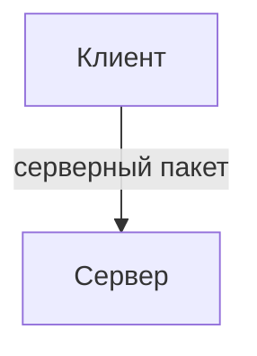
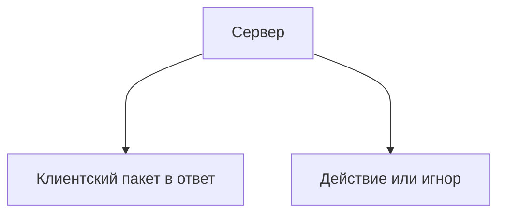

# Начало

Мультиплеер — одна из важнейших частей любого **не-клиентского мода**, которую создателю нужно поддерживать для того, чтобы игроки могли играть в мод вместе. А вместе с тем, одна из сложнейших для новичков.

Попробуем за одну статью разобрать, как разграничивать клиент и сервер и в чём их отличие, для чего нужны пакеты и определим, какие [события](../events/callbacks) относятся к клиентским, а какие к серверным.
Перед чтением статьи настоятельно рекомендую ознакомиться со следующими статьями, ведь материалы из них будут рассмотрены в данном разделе:

1. [Калбеки](../events/callbacks)
2. [Контейнеры](../storage/containers)
3. [Тайлы](../storage/tile-entities)
4. [Сохраняем данные](../storage/saving-basics)

## Клиент

Давайте попробуем понять сразу на примере игры. Представим, что мы находимся на сервере. Все игроки — это клиенты. Они не могут влиять на сервер напрямую, но они могут отправлять запросы (пакеты), а сервер может либо сделать какие-то действия, например отправить ответный пакет, либо проигнорировать или предпринять какие-то действия против клиента, если посчитает это нужным.

В случае, если сервер захочет отправить какие-то данные клиенту, он отправит ответный пакет, и такой пакет будет называться [клиентским](client-packets).

Клиенты знают только ту информацию, которая им нужна. Например это данные о мобах и блоках в загруженных им чанках, погоде и времени.

Давайте представим, что мы пишем мод и в качестве простого игрока на сервере пытаемся получить данные о подключённых игроках при помощи [`Network.getConnectedPlayers()`](/api/namespace/Network#getConnectedPlayers). Поскольку клиент этой информации не знает, мы не получим нужный нам список. Однако мы можем создать серверный пакет, который мы отправим на него и он сделает нужные нам действия со списком игроков сам. Почему бы просто не отправить серверу нам список игроков? Это может быть опасно, и о безопасности пакетов мы поговорим в будущем.

Распределяйте нагрузку так, чтобы вся визуальная информация вычислялась на клиенте.

Методы, которые выдают информацию клиентам принято называть ***клиентскими***, а которые меняют информацию сервера — ***серверными***.

Клиент не может использовать серверные методы, например ломать и ставить блоки при помощи [BlockSource](/api/core-engine/BlockSource.d.ts).

### Различие данных

Как мы и говорили ранее, игра не выдаёт те данные, которые клиент не должен знать.  Когда мы изменяем данные внутри нашего мода на хосте (игрок, которому принадлежит мир или серверное ПО), они и меняются только на сервере. Но на клиенте остаются прежними. Обычно сервер выдаёт необходимую клиентам информацию при помощи пакетов или [SyncedNetworkData](../events/using-synced-data).

:::danger Не храните важную для игры информацию на клиенте
Всей важной информацией, которая не касается визуальной части, должен заниматься сервер.
:::

## Сервер

Сервер представляет из себя компьютер, где запущен мир Minecraft. Он может напрямую взаимодействовать на мир и на данные, которые на нём хранятся, менять данные игроков из модов, к примеру такие, как: изучения, магический уровень и прочее. Сервер не знает информацию с клиента, если он не отправляет её при помощи [серверных пакетов](server-packets).
Вся нагрузка, которая не касается визуала, должна ложиться на сервер. Это разные системы, добавляемые модами, функционал блоков и прочее.

Пакеты, которые сервер принимает, называются [серверными](server-packets). Очень важно понимать, что на сервер не всегда могут поступать честные пакеты, некоторые моды могут отправлять пакеты с произвольными данными от недобросовестного разработчика, что конечно нужно учитывать. О безопасности поговорим в статье про серверные пакеты, но пока что просто запомните это.

## Хорошие и плохие примеры

Рассмотрим хорошие и плохие примеры реализации мультиплеера:

1. Плохие примеры
   1. Тайл энтити спавнит частицы не внутри [client.onTick](/api/namespace/TileEntity#LocalTileEntityPrototype), а отправляет пакет на клиент с запуском частиц.
   2. Один пакет используется на много действий, например для загрузки, разрушения, смены позиции и текстуры для [анимации](/api/namespace/Animation).
   3. Вместо создания пакета для запуска фигуры из частиц ([кстати, их мы рассматривали тут](../environment/particles)), отправляется один и тот же пакет для спавна одной частицы много раз, чтобы отрисовать эту же фигуру.
2. Хорошие примеры
   1. Клиентская часть тайл энтити отделена от сервера и данные поставляются при помощи SyncedNetworkData.
   2. Код грамотно разделён на пакеты, пакет не выполняет больше чем нужно, чтобы лишний раз не нагружать сервер.

:::warning Не экономьте пакеты

Не важно количество пакетов, старайтесь чтобы они не делали больше, чем требуется для решения конкретной задачи.

:::

## Клиентские и серверные события

Классификация событий по клиентским и серверным, если событие есть в обоих колонках, значит оно вызывается и для серверной, и для клиентской части:

### Ежетиковые события

| Клиентские | Серверные |
|---|---|
| tick | |
| LocalTick | |
| LocalPlayerTick | ServerPlayerTick |

### Появление моба в мире

| Клиентские | Серверные |
|---|---|
| EntityAddedLocal | EntityAdded |
| EntityRemovedLocal | EntityRemoved |
| LocalPlayerLoaded | ServerPlayerLoaded |

### Игрок сменил измерение

| Клиентские | Серверные |
|---|---|
| LocalPlayerChangedDimension | PlayerChangedDimension |
| | CustomDimensionTransfer |
| DimensionLoaded/Unloaded | |

### Изменение блоков

| Клиентские | Серверные |
|---|---|
| DestroyBlockStart | DestroyBlock |
| DestroyBlockContinue | |
| | BuildBlock |
| | BlockChanged |
| | BreakBlock |
| | PopBlockResources |
| | BlockEventEntityInside |
| | BlockEventEntityStepOn |
| | BlockEventNeighbourChange |
| | RedstoneSignal |
| | TileEntityAdded/Removed |

### Использование предметов

| Клиентские | Серверные |
|---|---|
| ItemUseLocal | ItemUse |
| ItemUseLocalServer | ItemUseServer |
| | ItemUsingReleased |
| | ItemUsingComplete |
| ItemUseNoTarget | |
| LocalPlayerEat | ServerPlayerEat |
| FoodEaten | FoodEaten |
| | ItemDispensed |

### Действия мобов

| Клиентские | Серверные |
|---|---|
| EntityHurt | EntityHurt |
| | PlayerAttack |
| | EntityInteract |
| | Exp(Level)Add |
| | ExpOrbsSpawned |
| | EntityPickUpDrop |
| | Explosion |
| | EntityDeath |
| | ProjectileHit |

### Генерация мира

| Клиентские | Серверные |
|---|---|
| | GenerateChunk и прочие |
| | Pre/PostProcessChunk |
| | GenerateBiomeMap |

### Действия в интерфейсе

| Клиентские | Серверные |
|---|---|
| CustomWindowOpened/Closed | ContainerOpened/Closed |
| NativeGuiChanged | |
| SystemKeyEventDispatched | |
| NavigationBackPressed | |
| AppSuspended | |
| OptionsChanged | |
| Все этапы загрузки игры | |

### Прочие события в мире

| Клиентские | Серверные |
|---|---|
| NativeCommand | |
| ItemName/IconOverride | |
| CustomBlockTessellation | |
| VanillaWorkbenchRecipeSelected | |
| | CraftRecipe(Pre)Provided |
| | VanillaWorkbench(Post)Craft |
| | EnchantPostAttack/Hurt |
| | EnchantGetDamage/ProtectionBonus |
| | Read/WriteSaves |

### Этапы загрузки/подключения к миру

| Клиентские | Серверные |
|---|---|
| LevelSelected | |
| ConnectingToHost | |
| LevelCreated | |
| RemoteLevel(Pre)Loaded | ServerLevel(Pre)Loaded |
| Level(Pre)Loaded | Level(Pre)Loaded |
| LevelDisplayed | |
| LocalLevel(Pre)Left | ServerLevel(Pre)Left |
| Level(Pre)Left | Level(Pre)Left |
| GameLeft | GameLeft |
