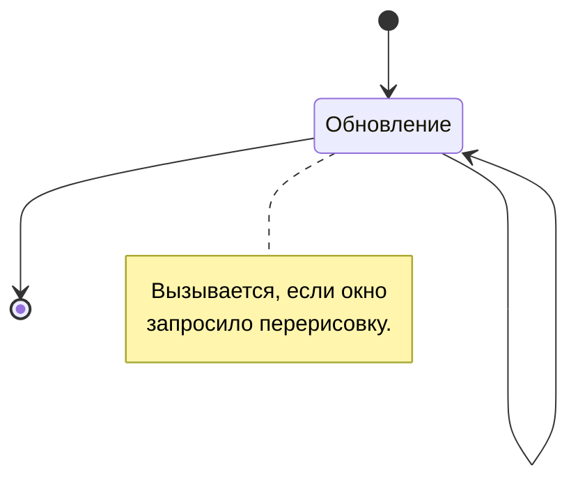

# Фоновая компоновка

Образует пространство окна, визуально обозначая его границы и добавляя фоновые объекты по необходимости. Эти компоненты всегда находятся под основными элементами, и также как и любые другие компоненты, отрисовываются на холсте (канвасе) в качестве контента вашего окна.

## Жизненный цикл



Весь цикл сводится к обновлению (перерисовке компонента, первая отрисовка тоже вызывает ее) если таковое было запрошено. Для этого задействуются функции [invalidateDrawing](/api/com/zhekasmirnov/innercore/api/mod/ui/window/IWindow/invalidateDrawing) окна или [invalidateUIDrawing](/api/com/zhekasmirnov/innercore/api/mod/ui/container/Container/invalidateUIDrawing) контейнера.

Фоновая компоновка не имеет событий, даже расширяемые компоненты могут быть лишь отрисованы. На то это и статичные компоненты, чтобы ни с чем не взаимодействовать.

## Разновидности компонентов

Компоненты фона задаются свойством `drawing` объекта описания окна. Они не имеют идентификаторов и могут быть обновлены только все вместе.

### Заливка

<div className="resource-atlas-align-box">


</div>

```js
{
    color: android.graphics.Color.WHITE
}
```

### Изображения

<div className="resource-atlas-align-box">


</div>

```js
{
    x: 40, y: 0,
    bitmap: "icon_menu_innercore"
}
```

По умолчанию, изображения отрисовываются с тем же количеством пикселей, что находятся в выбранной текстуре. Для изменения этого поведения, вручную установите ширину и высоту:

```js
{
    ...
    width: 128,
    height: 128
}
```

Или измените масштаб, на который будут умножены стандартные размеры и положение:

```js
{
    ...
    scale: 2.0
}
```

### Текст

<div className="resource-atlas-align-box">


</div>

```js
{
    x: 20, y: 40,
    text: "Привет"
}
```

### Линии

<div className="resource-atlas-align-box">


</div>

```js
{
    x1: 20, y1: 20,
    x2: 220, y2: 70,
    width: 5
}
```

По умолчанию, линии отрисовываются белым цветом, для изменения также как и в заливке, измените свойство:

```js
{
    ...
    color: android.graphics.Color.GREEN
}
```

### Растягиваемые фреймы

<div className="resource-atlas-align-box">


</div>

```js
{
    x: 60, y: 120,
    bitmap: "style:frame_background_light",
    width: 80, height: 26
}
```

Подобно `scale` в изображениях, масштаб влияет на отображение всего фрейма.

Не обязательно отрисовывать все стороны фрейма. К примеру, для вертикальных вкладок можно пропустить его нижнюю часть:

```js
{
    ...
    sides: {
        down: false
    }
}
```

И любые из сторон `up`, `left` или `right`, установив им значение `false`.

:::info Схожие реализации

Фреймы здесь по принципу схожи с [9-patch'ами](TODO), задействованными в Android. Для движка задействована собственная обработка и нельзя просто использовать патчи в качестве входных битмапов. Однако, нет никаких ограничений в использовании пакетов системы, так что вы можете просто обработать изображения на этапе предзагрузки.

:::
