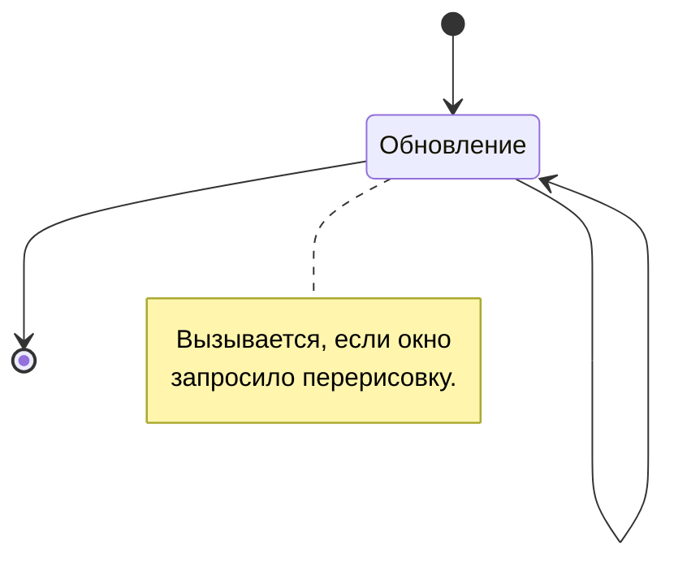

# Фоновая компоновка

Образует пространство окна, визуально обозначая его границы и добавляя фоновые объекты по необходимости. Эти компоненты всегда находятся под основными элементами, и также как и любые другие компоненты, отрисовываются на холсте (канвасе) в качестве контента вашего окна.

## Жизненный цикл



Весь цикл сводится к обновлению (перерисовке компонента, первая отрисовка тоже вызывает ее) если таковое было запрошено. Для этого задействуются функции [invalidateDrawing](/api/com/zhekasmirnov/innercore/api/mod/ui/window/IWindow/invalidateDrawing) окна или [invalidateUIDrawing](/api/com/zhekasmirnov/innercore/api/mod/ui/container/Container/invalidateUIDrawing) контейнера.

Фоновая компоновка не имеет событий, даже расширяемые компоненты могут быть лишь отрисованы. На то это и статичные компоненты, чтобы ни с чем не взаимодействовать.

## Разновидности компонентов

Компоненты фона задаются массивом `drawing` объекта описания окна. Они не имеют идентификаторов и могут быть обновлены только все вместе.

```js
new UI.Window({
    ...
    drawing: [
        // объект описания компонента
        {
            type: "компонент", // необходимое свойство
            ...
        },
        ...
    ]
})
```

Объектов описания компонентов может быть сколько угодно, они будут отрисованы один за другим, начиная с первого.

### Заливка

<div className="resource-atlas-align-box">


</div>

Заполняет весь контент окна заданным цветом, может быть полупрозрачным. Добавление прозрачной (`0`) заливки приведет к добавлению прозрачного фона окну (по умолчанию он черный).

```js
{
    type: "color",
    color: android.graphics.Color.WHITE
}
```

Это заполнит весь фон окна белым цветом. Помимо стандартных цветов, вроде `GREEN`, `RED` или `BLUE` обычно цвета задаются с помощью метода `argb`:

```js
android.graphics.Color.argb(127, 255, 255, 255)
```

Для установки прозрачности, красного, зеленого и синего цветов соответственно. Метод принимает целочисленные значения от 0 до 255, либо дроби от 0 до 1. Нередко для установки цвета используют hex-значения:

```js
android.graphics.Color.parseColor("#88ffffff")
```

При использовании свойства `mode`, режим смешивания позволит накладывать цвет с определенной маской. Подробнее о режимах смешивания можно почитать [здесь](TODO).

### Изображения

<div className="resource-atlas-align-box">


</div>

Отображает изображение из ресурсов папок интерфейса движка, используя заданные размеры, либо занимая количество пикселей в картинке. Нередко задействуется для визуального обозначения фона слотов и шкал.

```js
{
    type: "bitmap",
    x: 40, y: 0,
    bitmap: "icon_menu_innercore"
}
```

По умолчанию, изображения отрисовываются с тем же количеством пикселей, что находятся в выбранной текстуре. Для изменения этого поведения, вручную установите ширину и высоту:

```js
{
    ...
    width: 128,
    height: 128
}
```

Или измените масштаб, на который будут умножены стандартные размеры и положение:

```js
{
    ...
    scale: 2.0
}
```

:::warn Не используйте анимации на фоне

Изображения здесь статичны и не должны быть использованы для анимаций. Ручное обновление фоновой компоновки конечно вызовет требуемое поведение, но негативно повлияет на производительность.

Хотите добавить компонент с анимацией? Рассмотрите [одноименный виджет](elements.md#изображения) в элементах.

:::

### Текст

<div className="resource-atlas-align-box">


</div>

Единственный компонент для отрисовки текста, позволяет настроить цвет, размер и несколько элементов стиля. В качестве шрифта задействуется [Minecraft (hy60koshk)](TODO), включающий в себя основные символы и поддержку кириллицы.

```js
{
    type: "text",
    x: 20, y: 40,
    text: "Привет"
}
```

Все остальные свойства настраиваются с помощью объекта шрифта, включающего некоторое количество опций:

```js
{
    ...
    font: {
        color: android.graphics.Color.WHITE,
        // размер текста в юнитах
        size: 20,
        // выравнивание текста относительно его
        // положения: слева сверху (0), по центру (1),
        // справа снизу (2), справа по центру (3)
        alignment: 0,
        // смещение тени текста, значение от 0 до 1,
        // где ноль означает полное отсутствие;
        // чем больше смещение, тем тень темнее
        shadow: 0,
        bold: false, // толстый или плотный текст
        cursive: false, // курсивный текст с наклоном
        underline: false // подчеркнутый текст
    }
}
```

Здесь представлены значения по умолчанию, так что просто измените нужные "под себя".

### Линии

<div className="resource-atlas-align-box">


</div>

Линии представляют собой отрезки фиксированной толщины между двумя точками в пространстве. Используйте их для разделения контента, это особенно удобно для оптимизации памяти от потребления текстур.

```js
{
    type: "line",
    x1: 20, y1: 20,
    x2: 220, y2: 70,
    width: 5
}
```

По умолчанию, линии отрисовываются белым цветом, для изменения, также как и в заливке, измените свойство:

```js
{
    ...
    color: android.graphics.Color.GREEN
}
```

### Растягиваемые фреймы

<div className="resource-atlas-align-box">


</div>

В отличии от изображений, фреймы позволяют разделить картинки на восемь частей для растяжки четырех из них, не изменяя пропорции граней картинки.

```js
{
    type: "frame",
    x: 60, y: 120,
    bitmap: "style:frame_background_light",
    width: 80, height: 26
}
```

Подобно `scale` в изображениях, масштаб влияет на отображение всего фрейма. Используйте это свойство для определения толщины рамки, обычно текстуры из модификаций на Forge используют значение `2`.

:::tip Как это работает

Во время загрузки изображение разделяется на восемь частей, не считая центральной.

<table className="block-uv-table">
    <center>
        <tr>
            <td>грань</td>
            <td>сторона</td>
            <td>грань</td>
        </tr>
        <tr>
            <td>сторона</td>
            <td/>
            <td>сторона</td>
        </tr>
        <tr>
            <td>грань</td>
            <td>сторона</td>
            <td>грань</td>
        </tr>
    </center>
</table>

Каждая часть масштабируется за счет свойства `scale`, после чего, отрисовываются растянутые по ширине и высоте стороны, нетронутые грани и центральный цвет.

Центральный цвет заполняет больше всего пространства, определяется свойством `color`, либо автоматически.

:::

Не обязательно отрисовывать все стороны фрейма. К примеру, для вертикальных вкладок можно пропустить его нижнюю часть:

```js
{
    ...
    sides: {
        down: false
    }
}
```

И любые из сторон `up`, `left` или `right`, установив им значение `false`.

:::info Схожие реализации

Фреймы здесь по принципу схожи с [ninepatch (9-patch)](TODO), задействованном в Android. Изучите эту статью для глубинного понимания работы механизма обработки фреймов, как происходит расскройка картинок на части и их последующая склейка в цельное изображение.

Для движка задействована собственная обработка и нельзя просто использовать патчи в качестве входных картинок. Однако, нет никаких ограничений в использовании пакетов системы, так что вы можете просто обработать изображения на этапе предзагрузки для их отображения.

:::
