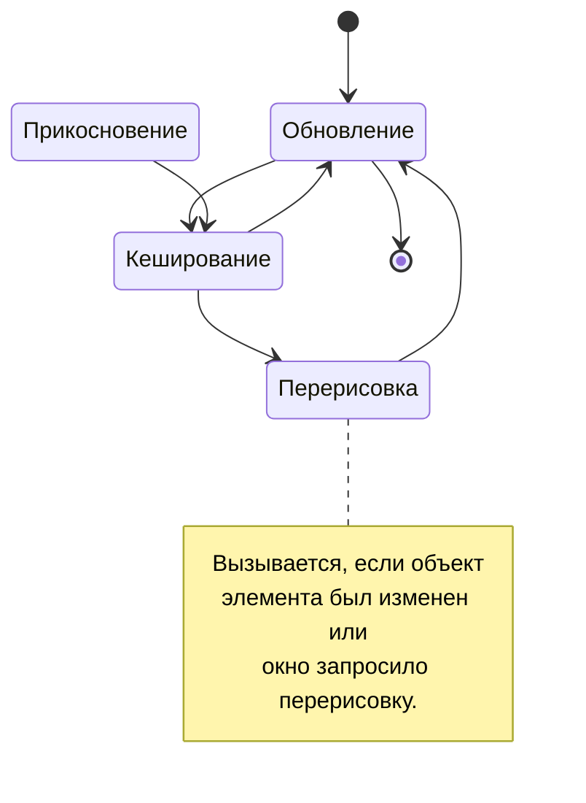

# Элементы

Осуществляют большинство функций, требуемых от интерфейса. Элемент обрабатывает действия пользователя и на их основе изменяется, переключая свое состояние или сообщая о взаимодействии окну. Также как и любой другой компонент, элемент отрисовывается на холсте (канвасе), но еще и может динамически изменять свое содержимое.

## Жизненный цикл



Помимо стандартного обновления фоновой компановки, элементы определяют прикосновения пользователя, обрабатывают биндинги и кешируются для автоматического обновления самих себя.

Как и другие компоненты, элементы могут быть перерисованы с помощью функции [invalidateElements](/api/interfaces/UI.IWindow.html#invalidateElements) или [invalidateUIElements](/api/classes/UI.Container.html#invalidateUIElements) контейнера. Это немедленно приведет к перекешированию всех элементов, правда обычно стандартного кеширования раз в пол секунды вполне достаточно для стабильного обновления.

Некоторые элементы имеют собственные события, они напрямую связаны с взаимодействиями пользователя, практически все (за исключением слотов инвентаря) обрабатывают еще и прикосновения, объекты описания которых приведены в [соответствующем параграфе](#общие-свойства).

## Разновидности элементов

Компоненты в элементах определяются в свойстве `elements` объекта описания окна. Любой элемент может быть получен по идентификатору, изменен или привязан к глобальному свойству окна.

```js
new UI.Window({
    ...
    elements: {
        // объект описания компонента
        some_identifier: {
            type: "компонент", // необходимое свойство
            ...
        },
        ...
    }
})
```

Объектов описания компонентов может быть сколько угодно, порядок элементов в объекте сохраняется и при отрисовке.

:::tip Комбинируйте!

Большинство элементов друг без друга будут выглядеть странно. К примеру, как можно представить себе обычную кнопку без текста. Что она должна делать? А может, вы хотели бы увеличить размер фона слота, не изменяя все остальное? Используйте комбинацию из нескольких элементов.

:::

### Общие свойства

В отличии от элементов фоновой компоновки, элементы основываются на общем прототипе, задающем несколько базовых свойств жизненного цикла и местоположения. Чтобы не рассматривать их в каждом элементе, выделим общие здесь.

Любой элемент, помимо необходимого свойства, описывающего вид компонента, должен содержать информацию о местоположении на экране. Для этого используется координаты из ординаты и абсциссы:

```js
{
    ...
    x: 0, y: 0
}
```

Местоположение как и прочие величины размера представлены в юнитах, напомню что это 1/1000 ширины окна. Несмотря на то что экран двухмерный, задание перекрытий позволяет перекрывать элементы позади себя. Для этого используется свойство глубины:

```js
{
    ...
    z: 0
}
```

Чем его значение больше, тем элемент ближе. Используйте это свойство если не хотите изменять порядок элементов или обновляете компонент через некоторое время.

Нажатие по элементу приводит к соответствующему событию, клику:

```js
{
    ...
    onClick: function(container, window, component, location) {
        ...
    }
}
```

Здесь предоставляется контейнер (если есть), окно привязанное к нему, сам элемент и точка, где было произведено нажатие относительно местоположения элемента. Помимо стандартного нажатия, это действие обрабатывает удержание. Однако, существует возможность обрабатывать удержание отдельно, не вызывая событие клика:

```js
{
    ...
    onLongClick: function(container, window, component, location) {
        ...
    }
}
```

Но чтобы еще более тонко настроить взаимодействие с компонентом, можете обработать события самостоятельно. Остальные действия все так же будут проходить, используйте только необходимые типы:

```js
{
    ...
    onTouchEvent: function(component, event) {
        switch (event.type.name()) {
            case "DOWN":
                // первое прикосновение к компоненту
                break;
            case "MOVE":
                // перемещение пальца по компоненту,
                // вызывается каждый момент прикосновения
                // при малейших изменениях жеста
                break;
            case "CLICK":
            case "LONG_CLICK":
                // стандартные события нажатия и удержания;
                // если были вызваны, тип окончания события
                // не будет вызван и перезапишется
                break;
            case "UP":
            case "CANCEL":
                // взаимодействие окончено или отменено
                // (отменяется системными действиями)
                break;
        }
    }
}
```

Рассмотрите [TouchEvent](TODO) для получения подробностей о доступных свойствах и методах параметра `event`.

### Изображения

<div className="resource-atlas-align-box">


</div>

Отображает изображение из ресурсов папок интерфейса движка, используя заданные размеры, либо занимая количество пикселей в картинке. Используется для анимаций и отображения статичных элементов.

```js
{
    type: "bitmap",
    x: 40, y: 0,
    bitmap: "icon_menu_innercore"
}
```

По умолчанию, изображения отрисовываются с тем же количеством пикселей, что находятся в выбранной текстуре. Для изменения этого поведения, вручную установите ширину и высоту:

```js
{
    ...
    width: 128,
    height: 128
}
```

Или измените масштаб, на который будут умножены стандартные размеры и положение:

```js
{
    ...
    scale: 2.0
}
```

Помимо прочего, изображения в элементах могут отрисовывать картинку над собой:

```js
{
    ...
    overlay: "icon_mod_edit"
}
```

Тогда, основной `bitmap` станет чем-то вроде фонового изображения.

### Текст

<div className="resource-atlas-align-box">


</div>

Единственный компонент для отрисовки текста, позволяет настроить цвет, размер и несколько элементов стиля. В качестве шрифта задействуется [Minecraft (hy60koshk)](TODO), включающий в себя основные символы и поддержку кириллицы.

```js
{
    type: "text",
    x: 20, y: 40,
    text: "Привет"
}
```

Все остальные свойства настраиваются с помощью объекта шрифта, включающего некоторое количество опций:

```js
{
    ...
    font: {
        color: android.graphics.Color.WHITE,
        // размер текста в юнитах
        size: 20,
        // выравнивание текста относительно его
        // положения: слева сверху (0), по центру (1),
        // справа снизу (2), справа по центру (3)
        alignment: 0,
        // смещение тени текста, значение от 0 до 1,
        // где ноль означает полное отсутствие;
        // чем больше смещение, тем тень темнее
        shadow: 0,
        bold: false, // толстый или плотный текст
        cursive: false, // курсивный текст с наклоном
        underline: false // подчеркнутый текст
    }
}
```

Здесь представлены значения по умолчанию, так что просто измените нужные "под себя".

В отличии от [фоновой компоновки](drawings.md#текст), текст в виде элемента поддерживает переносы на новую строку. Его настройки определяют свойства:

```js
{
    ...
    multiline: false, // обработка переносов
    // нужно ли дополнительно обработать
    // текст перед отрисовкой, нужно для
    // следующего свойства
    format: false,
    // максимальное количество символов на
    // одной строке, остальные будут
    // перенесены; требует multine и format
    formatMaxCharsPerLine: 999
}
```

### Кнопки

<div className="resource-atlas-align-box">


</div>

Кнопки представляют собой изображение, изменяющееся при взаимодействии с ней. Имеет два состояния — пассивное и активное; последнее вызывается вследствии наведения курсора или пальца, нажатия и удержания.

```js
{
    type: "button",
    x: 120, y: 40,
    bitmap: "classic_button_frame_up",
    bitmap2: "classic_button_frame_hover"
}
```

Несмотря на то что любая кнопка представляет собой изображение, она не может быть растянута движком. Вы должны позаботиться о подготовке кнопок нужных размеров перед их отображением, параметр `scale` поможет изменить масштаб если это необходимо.

Рассмотрите [общие свойства](#общие-свойства) для определения событий, вызываемых кнопкой и прочими элементами.

### Слоты

<div className="resource-atlas-align-box">


</div>

Помимо визуальной части, этот элемент содержит в себе предмет. Привязка окна к контейнеру позволит игроку взаимодействовать со слотами, перемещая в них предметы из слотов инвентаря.

```js
{
    type: "slot",
    x: 240, y: 160,
    bitmap: "style:slot",
    size: 60
}
```

Текстура не обязательна, также как и размер, они представлены как размеры по умолчанию. Слот состоит из фонового изображения, изображения самого предмета, текста его количества и оверлея обводки (при выборе этого слота). Это предоставляет некоторое количество свойств для более глубокой настройки:

```js
{
    ...
    // с визуальными слотами нельзя взаимодействовать
    // обычным способом, но можно использовать общие
    // события для собственной реализации логики слота
    visual: false,
    // затемнит слой в любом случае, используйте
    // для обозначения требуемого предмета
    darken: false,
    // затемнит слой, если в нем нет предмета,
    // но указан его идентификатор
    isDarkenAtZero: true,
    // текст количества предмета, само количество
    // выведено не будет
    text: null,
    // масштаб предмета относительно слота
    iconScale: 0.82,
    // отключение сглаживания количества пикселей в
    // иконке предмета; включите для более тонкой
    // настройки масштаба иконки, однако учтите, что
    // на разных экранах слот может "размываться"
    disablePixelPerfect: false
}
```

Предмет настраивается самим контейнером (использованием биндингов), либо вручную. В последнем случае рекомендуется сделать слой визуальным с помощью свойства выше, рассмотрим свойства предмета:

```js
{
    ...
    source: {
        id: VanillaItemID.diamond,
        data: 0,
        count: 64,
        extra: null
    }
}
```

Достаточно использования лишь идентификатора и количества, остальные свойства задаются автоматически. Ограничьте размер стака, если слот должен выдавать меньше предметов, чем содержит:

```js
{
    ...
    maxStackSize: 16
}
```

Значение 0 будет означать запрет на взаимодействие с предметом, его блокировкой, -1 отсутствие ограничения (значение по умолчанию). Как использовать контейнеры для изменения слота можно узнать в статье [TODO](TODO), этот метод предпочтителен в большинстве случаев.

Появилась потребность определить когда предмет в слоте был изменен? Используйте соответствующее событие:

```js
{
    ...
    onItemChanged: function(container, oldId, oldCount, oldData) {
        ...
    }
}
```

Добавьте метод для ограничения предметов, которые могут быть перемещены в слот:

```js
{
    ...
    isValid: function(id, count, data, container, item) {
        ...
        return true;
    }
}
```

Но учтите, что однажды добавленные в контейнер предметы сохраняются, а этим свойством будет запрещено и их получение, делая слот заблокированным.

### Шкалы

<div className="resource-atlas-align-box">


</div>

Шкала используется для отображения прогрессов, уровня заполненности хранилища, количества накопленной энергии и прочих величин. Воспользуйтесь [ползунком](#ползунки) для изменения величины игроком, шкалы лишь отображают значение.

```js
{
    type: "scale",
    x: 40, y: 320,
    bitmap: "_liquid_water_texture_0",
    background: "_liquid_milk_texture_0",
    direction: 1
}
```

Свойство `direction` определяет направление шкалы, оно может быть: слева-направо (0, по умолчанию), снизу-вверх (1),
справа-налево (2) или сверху-вниз (3). Определите свойство `value` для определения значения этой шкалы, дробью от 0 до 1.

По умолчанию, шкалы отрисовываются с тем же количеством пикселей, что находятся в выбранной текстуре. Для изменения этого поведения, вручную установите ширину и высоту:

```js
{
    ...
    width: 48,
    height: 240
}
```

Используйте параметр `scale` для изменения масштаба элемента, он идентичен свойству в остальных компонентах.

Шкалы предусматривают сразу несколько текстур для наложения друг на друга в разных сценариях, используя лишь один компонент. Для этого помимо основной шкалы, есть фон и оверлей:

```js
{
    ...
    background: "_liquid_milk_texture_0",
    backgroundOffset: { x: 0, y: 0 },
    overlay: "_liquid_empty_texture_0",
    overlayOffset: { x: 0, y: 0 }
}
```

А также несколько свойств для описания самой шкалы:

```js
{
    ...
    // сглаживание шкалы попиксельно
    pixelate: false,
    // инвертирует визуальное значение шкалы,
    // к примеру 0.3 станет 0.7
    invert: false
}
```

### Переключатели

<div className="resource-atlas-align-box">


</div>

Переключатель является усложненной реализацией кнопки, включая в себя сменяемое состояние. Хотите объяснение попроще? Возможно, большинству знакомы флажки или чекбоксы. Переключатели более заметны визуальнее, механика идентична.

```js
{
    type: "switch",
    x: 600, y: 40
}
```

Задание текстур не обязательно, будут использованы стандартные из визуального примера. Если основная текстура любого из состояний будет изменена, то и текстура наведения (hover) должна быть использована. Иначе удержание и прочие взаимодействия не будут визуализированы:

```js
{
    ...
    bitmapOn: "default_switch_on",
    bitmapOnHover: "default_switch_on_hover",
    bitmapOff: "default_switch_off",
    bitmapOffHover: "default_switch_off_hover"
}
```

Специально для управления состоянием переключателя предоставляется несколько способов его синхронизации и ручного изменения. В общем случае, большинству подойдет свойство состояния:

```js
{
    ...
    state: false
}
```

Помимо этого свойства, состояние можно привязать к значению в конфиге, тогда его сохранение произойдет автоматически:

```js
{
    ...
    configValue: __config__.getValue("some_property")
}
```

Или к свойству в объекте, оно также будет изменено переключателем:

```js
const PROPERTIES = {
    ...
    myBool: true
}
```

```js
{
    ...
    bindingObject: PROPERTIES,
    bindingProperty: "myBool" // по умолчанию "on"
}
```

Следите за изменением состояния, используя соответствующее событие:

```js
{
    ...
    onNewState: function(value, container, component) {
        ...
    }
}
```

Используйте параметр `scale` для изменения масштаба элемента, он идентичен свойству в остальных компонентах.

### Ползунки

<div className="resource-atlas-align-box">


</div>

Прикоснувшись в любое место ползунка, его величина будет изменена и указатель сместится в новое место. Ползунки могут быть использованы для совершенно разных целей, даже не обязательно для числовых значений.

```js
{
    type: "scroll",
    x: 80, y: 200,
    width: 64,
    length: 500
}
```

Свойство ширины (`width`) определит высоту ползунка, долгота (`length`) определит его длину. Почему ползунок называется "scroll", а не "seek"? Спросите у [Жеки](https://vk.me/id24708057).

Задание текстур не обязательно, будут использованы стандартные из визуального примера. Если основная текстура любого из состояний будет изменена, то и текстура наведения (hover) должна быть использована. Иначе удержание и прочие взаимодействия не будут визуализированы:

```js
{
    ...
    bitmapHandle: "default_scroll_handle",
    bitmapHandleHover: "default_scroll_handle_hover",
    bitmapBg: "default_scroll_bg",
    bitmapBgHover: "default_scroll_bg_hover",
    ratio: 0.6
}
```

Свойство `ratio` необходимо переопределить если меняется текстура фона, она представляет собой [фрейм](#растягиваемые-фреймы), растягиваемый по ширине этим свойством.

Переопределите интервалы значений, определяемые ползунком:

```js
{
    ...
    min: 0,
    max: 1,
    // количество шагов, которое ползунок может пройти
    // от минимального до максимального значения
    divider: 1000
}
```

Специально для управления величиной ползунка предоставляется несколько способов его синхронизации и ручного изменения. В общем случае, большинству подойдет свойство величины:

```js
{
    ...
    value: 0
}
```

Помимо этого свойства, величину можно привязать к значению в конфиге, тогда его сохранение произойдет автоматически:

```js
{
    ...
    configValue: __config__.getValue("some_property")
}
```

Или к свойству в объекте, оно также будет изменено ползунком:

```js
const PROPERTIES = {
    ...
    myNumber: 0.3
}
```

```js
{
    ...
    bindingObject: PROPERTIES,
    bindingProperty: "myNumber" // по умолчанию "value"
}
```

Следите за изменением величины, используя соответствующее событие:

```js
{
    ...
    onNewValue: function(value, container, component) {
        ...
    }
}
```

Ползунок может обрабатывать целочисленные значения, а не дроби. В таком случае, переопределите значения минимума и максимума, шаг будет переопределен до единицы автоматически. Используйте свойство:

```js
{
    ...
    isInt: true
}
```

### Растягиваемые фреймы

<div className="resource-atlas-align-box">


</div>

В отличии от изображений, фреймы позволяют разделить картинки на восемь частей для растяжки четырех из них, не изменяя пропорции граней картинки.

```js
{
    type: "frame",
    x: 60, y: 120,
    bitmap: "style:frame_header",
    width: 80, height: 26
}
```

Подобно `scale` в изображениях, масштаб влияет на отображение всего фрейма. Используйте это свойство для определения толщины рамки, обычно текстуры из модификаций на Forge используют значение 2.

:::info Как это работает

Во время загрузки изображение разделяется на восемь частей, не считая центральной.

<table className="block-uv-table">
    <tr>
        <td>грань</td>
        <td>сторона</td>
        <td>грань</td>
    </tr>
    <tr>
        <td>сторона</td>
        <td/>
        <td>сторона</td>
    </tr>
    <tr>
        <td>грань</td>
        <td>сторона</td>
        <td>грань</td>
    </tr>
</table>

Каждая часть масштабируется за счет свойства `scale`, после чего, отрисовываются растянутые по ширине и высоте стороны, нетронутые грани и центральный цвет.

Центральный цвет заполняет больше всего пространства, определяется свойством `color`, либо автоматически.

:::

Не обязательно отрисовывать все стороны фрейма. К примеру, для вертикальных вкладок можно пропустить его нижнюю часть:

```js
{
    ...
    sides: {
        down: false
    }
}
```

И любые из сторон `up`, `left` или `right`, установив им значение `false`.

:::note Схожие реализации

Фреймы здесь по принципу схожи с [ninepatch (9-patch)](TODO), задействованном в Android. Изучите эту статью для глубинного понимания работы механизма обработки фреймов, как происходит расскройка картинок на части и их последующая склейка в цельное изображение.

Для движка задействована собственная обработка и нельзя просто использовать патчи в качестве входных картинок. Однако, нет никаких ограничений в использовании пакетов системы, так что вы можете просто обработать изображения на этапе предзагрузки для их отображения.

:::

### Оставшиеся компоненты

Здесь представлен не весь список элементов, а лишь его уникальные части. К примеру, слоты подразделяются на обычные и с привязкой к инвентарю, а помимо обычной кнопки существует кнопка закрытия. Основываясь на шаблонах из этой статьи, о них рассказано в [расширении компонентов](extending-components.md#встроенные-реализации).
