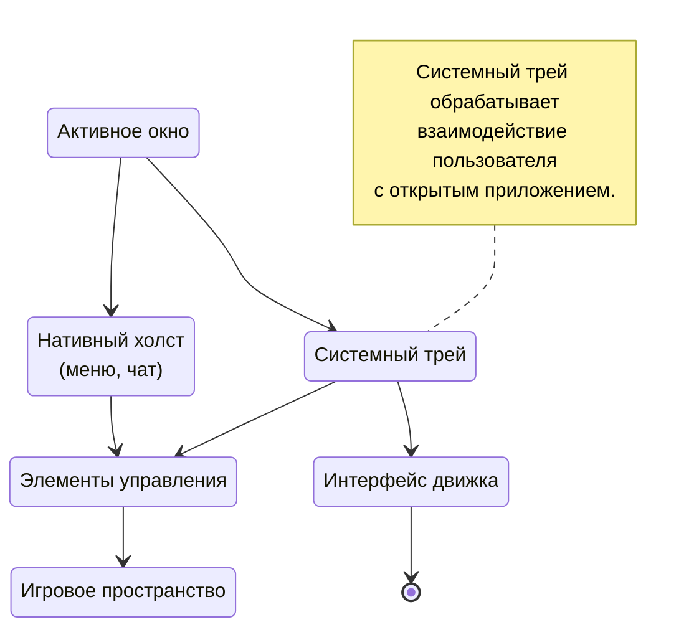
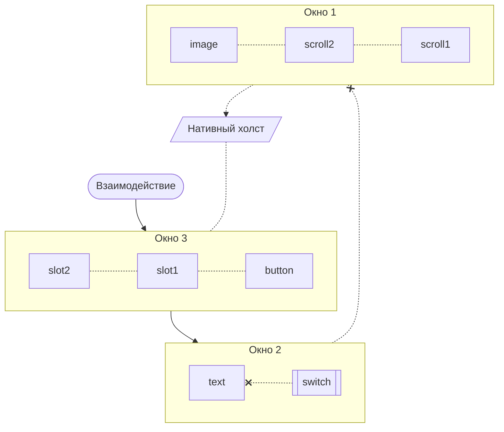

# Исследуем содержимое

Интерфейс в Inner Core построен на основе графической оболочки Android, все элементы которого отрисовываются на едином холсте (канвасе) для каждого окна. Отображение происходит поверх игрового процесса, что не позволяет изменять внутреигровой интерфейс, но расширяет возможности работы с контентом.

## Структура

Если не вдаваться в подробности, существует игровое пространство и содержимое вокруг него (контроллер, различные меню, а также открытые модами окна).

Выходной точкой как раз и является контент, открываемый модами. В зависимости от вида окна контент может как покрывать всю область экрана, так и служить лишь вспомогательным органом управления.

## Открытые окна

Состоят из контента, в который входят фоновая компоновка и основные элементы над ней. Сам контент включает в себя проводник в виде контейнера, он нужен для хранения данных и работы с инвентарем. Такая структура задействована для каждого окна, элементы динамически и автоматически обновляются при изменении.

### Фоновая компоновка

Как и следует из названия, служит слоем под основным контентом. С компонентами здесь нельзя взаимодействовать, и они, в большинстве своем, статичны.

Обычно здесь находятся рамка окна, обводка для прозрачных слотов, шкал, и прочее.

### Элементы

Непосредственно контент, он будет расположен над всеми остальными слоями этого окна, а пользователь сможет с ним взаимодействовать. Кнопки, переключатели и слоты лишь малая часть того, что может распологаться здесь.

### Контейнер

Контейнеры служат оболочкой для окна, они контролируют его жизненный цикл и осуществляют операции со слотами.

Если же открывать окна напрямую, не используя контейнер, со слотами нельзя будет взаимодействовать напрямую игроку. Хотя впрочем существуют ситуации когда контейнер действительно не нужен, например, паре кнопок во вспомогательном игровом окне.

## Взаимодействие

Что мы имеем ввиду под взаимодействием? Любое нажатие, щепок, пролистывание и даже просто прикосновение к экрану являются таковыми. Не стоит забывать и про клавиатуру с мышкой.

Прежде чем устройство сможет понять с чем конкретно произошло взаимодействие, необходимо пройтись по иерархии открытых окон и элементах в них. Приоритетными являются окна, открытые позже всего, и элементы, добавленные после остальных.

Окна, с которыми можно взаимодействовать, в любом случае перекроют собой весь контент позади себя. Представьте себе листы бумаги, лежащие друг на друге. Примерно таким же бутербродом являются и окна интерфейса здесь.
